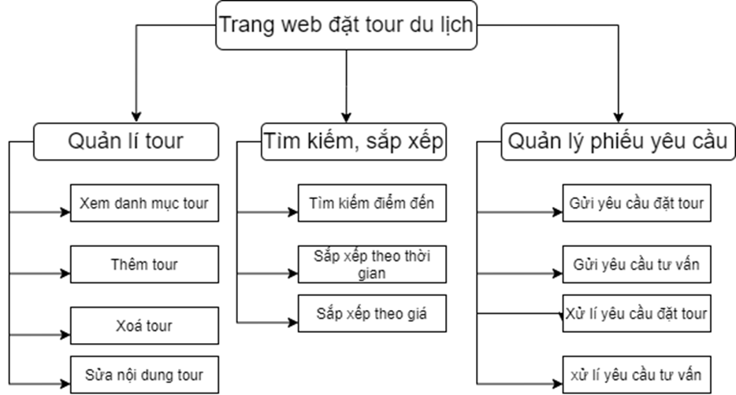
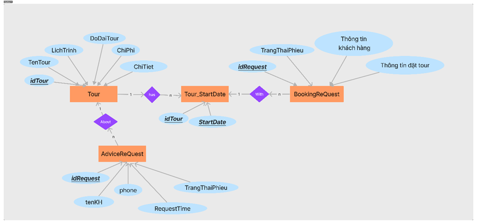
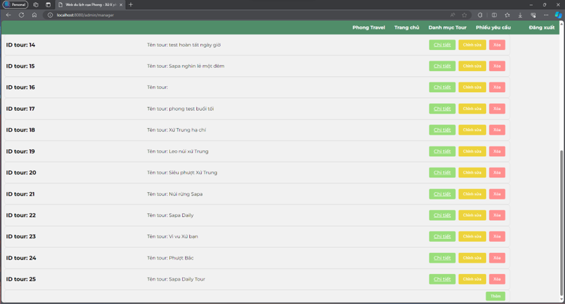
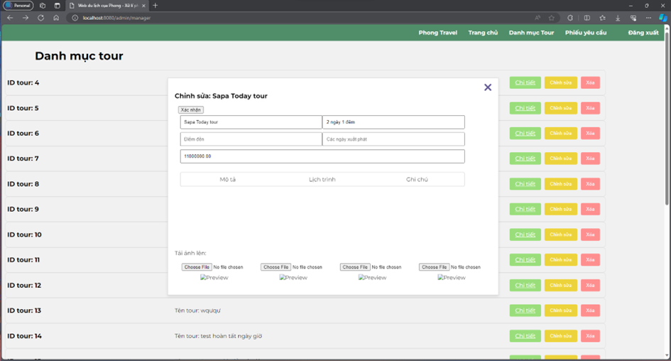
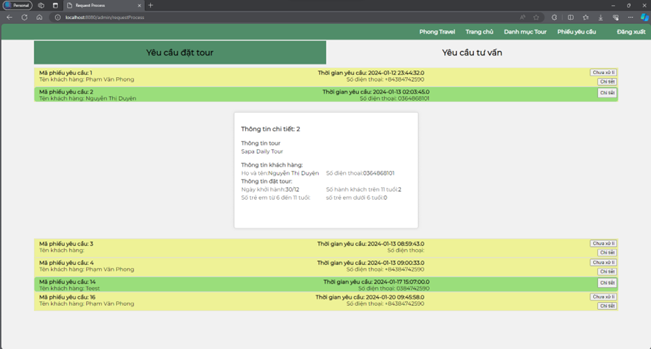

# Phong Travel - Tourism Booking System

## Introduction
Phong Travel is a comprehensive web application designed for small and medium-sized travel agencies to market their tour packages and manage customer bookings. The system provides an intuitive interface for customers to browse tours, view details, make bookings, and request further information. The admin panel allows travel agencies to manage tours, handle customer requests, and process bookings efficiently.

## Features

### For Customers (Guest)
- Browse available tours with filtering and searching capabilities
- View detailed tour information including itinerary, schedules, and pricing
- Book tours with customization for number of travelers by age group
- Request callback for consulting services
- Calculate tour prices based on number and age of travelers

### For Administrators
- Secure login system for administrators
- Comprehensive tour management (create, edit, delete)
- Process booking requests and advising requests
- Upload and manage tour images
- Configure tour dates and schedules

## Technologies Used
- **Backend:** Java Spring Boot
- **Frontend:** HTML, CSS, JavaScript, Thymeleaf
- **Architecture:** MVC (Model-View-Controller)
- **Database:** JPA/Hibernate ORM
- **Security:** Spring Security

## Main Fuction


## Database Schema



The database design includes the following key tables:
- **Tour:** Stores tour information including name, description, pricing, and schedules
- **StartDateTour:** Manages available departure dates for each tour
- **Image:** Contains tour images with references to their respective tours
- **BookingRequest:** Tracks customer booking submissions with details about travelers
- **AdviceRequest:** Records customer requests for additional tour information

## Screenshots

### Main Page
The landing page features a search functionality and highlighted tours.


### Tour Listing
Users can browse all available tours with filtering options.


### Tour Detail
Detailed view of tour information including itinerary, schedule, and pricing.


### Booking Modal
Interactive form for customers to book tours with price calculation.


### Admin Tour Management
Administrative interface for managing all tours in the system.



### Admin Tour Details
Interface for administrators to edit tour details and properties.



### Admin Request Handling
Interface for handling customer booking and advice requests.



## Installation and Setup

### Prerequisites
- JDK 11 or higher
- Maven
- MySQL Database

### Steps
1. Clone the repository
```bash
git clone https://github.com/phongnickchinh/Project1.dulich-web
```

2. Configure database properties in `application.properties`
```properties
spring.datasource.url=jdbc:mysql://localhost:3306/tourdb
spring.datasource.username=root
spring.datasource.password=yourpassword
```

3. Build the project
```bash
mvn clean install
```

4. Run the application
```bash
mvn spring-boot:run
```

5. Access the application
- Customer portal: http://localhost:8080/guest/homepageGuest
- Admin portal: http://localhost:8080/admin/login

## Project Structure
```
dulich/
├── src/
│   ├── main/
│   │   ├── java/
│   │   │   └── com/pweb/dulich/
│   │   │       ├── controller/
│   │   │       │   ├── admin/
│   │   │       │   └── guest/
│   │   │       ├── dto/
│   │   │       ├── model/
│   │   │       ├── repository/
│   │   │       └── service/
│   │   └── resources/
│   │       ├── static/
│   │       │   ├── assets/
│   │       │   │   ├── css/
│   │       │   │   └── js/
│   │       │   └── img/
│   │       └── templates/
│   │           ├── admin/
│   │           └── guest/
│   └── test/
└── pom.xml
```

## Future Enhancements
- User authentication for customers
- Payment gateway integration
- Responsive mobile design
- Multi-language support
- Tour reviews and ratings